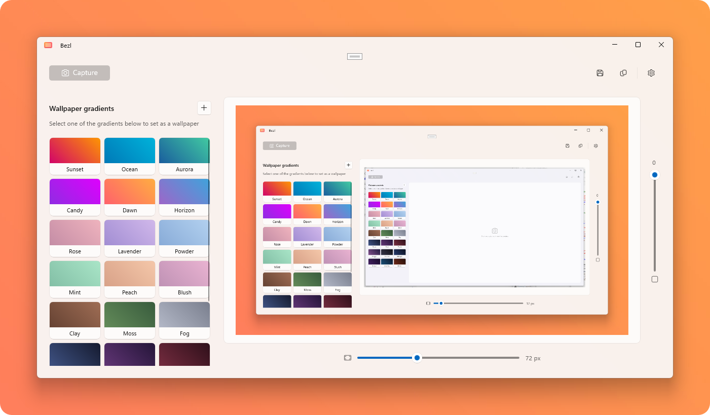

<p align="center">
  
</p>

<h1 align="center">Bezl</h1>
<p align="center">Beautiful screenshot borders made easy</p>

<p align="center">
  <a style="text-decoration:none" href="https://apps.microsoft.com/detail/9P17D7CZ0PZC?launch=true&mode=full">
    <picture>
      <source media="(prefers-color-scheme: light)" srcset="./.github/assets/StoreBadge-dark.png" width="220" />
      
    </picture>
  </a>
</p>

Bezl lets you create beautiful screenshots in seconds. Pick any open window, and Bezl captures it — then adjust the padding and corner radius to get the perfect framed look. Pair it with a gradient wallpaper backdrop so your window truly shines, and export the result as a polished PNG or straight to your clipboard.

<p align="center">
  
</p>

## ⭐ Features

- **Click-to-pick capture** — Select any open window using the system picker and Bezl does the rest
- **Adjustable padding** — Fine-tune the border space around your screenshot after capture
- **Corner radius** — Round the corners for a polished, modern look
- **Gradient wallpapers** — Choose from 24 built-in gradient presets or create your own, then set it as your desktop wallpaper so every capture has a beautiful backdrop
- **Export options** — Copy to clipboard or save as PNG

## 🚀 Getting started

### 1. Set up the environment

> [!NOTE]
> Bezl requires [Visual Studio 2022](https://visualstudio.microsoft.com/vs/) or later to build and Windows 10 (19041+) or later to execute.

**Required [Visual Studio components](https://learn.microsoft.com/windows/apps/get-started/start-here?tabs=vs-2022-17-10#required-workloads-and-components):**
- .NET Desktop Development
- Windows application development

Or, if building from the command line:
- [.NET 9 SDK](https://dotnet.microsoft.com/download/dotnet/9.0)
- [Windows App SDK 1.8+](https://learn.microsoft.com/windows/apps/windows-app-sdk/downloads)

### 2. Clone the repository

```powershell
git clone https://github.com/niels9001/Bezl.git
```

### 3. Build and run

**Visual Studio:** Open `Bezl.sln`, set `Bezl` as the startup project, select `x64`, and run.

**Command line:**
```powershell
dotnet build Bezl\Bezl.csproj -p:Platform=x64
dotnet run --project Bezl\Bezl.csproj
```

## 🖼️ How It Works

1. **(Optional) Set a gradient wallpaper** — Pick a preset or create your own gradient and apply it as your desktop wallpaper for a beautiful backdrop
2. **Capture a window** — Click "Capture" and select the window you want to screenshot
3. **Adjust** — Tweak the padding and corner radius until it looks just right
4. **Export** — Copy to clipboard or save as PNG

## ➡️ Related

- [Get started with WinUI](https://learn.microsoft.com/windows/apps/get-started/start-here)
- [Windows App SDK](https://github.com/microsoft/WindowsAppSDK)

## License

[MIT](LICENSE)
